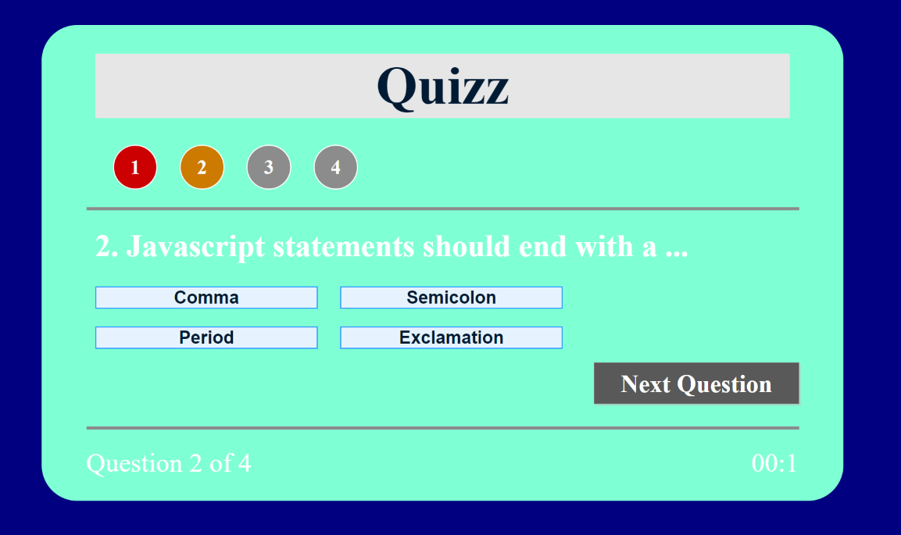

# Quiz

## Challenge 4

## Web-APIs

## Coding Quiz

Unit 4 challenge was to build and online quiz by manipulating the DOM. The user answers a series of multiple choice questions. No starter code was given. I had to build the html, css and js files. This project utilized and increased my knowledge of: event listeners, timers/intervals and interval clears, text content, local storage, and query selectors.

## https://dre0239.github.io/Quizz/
